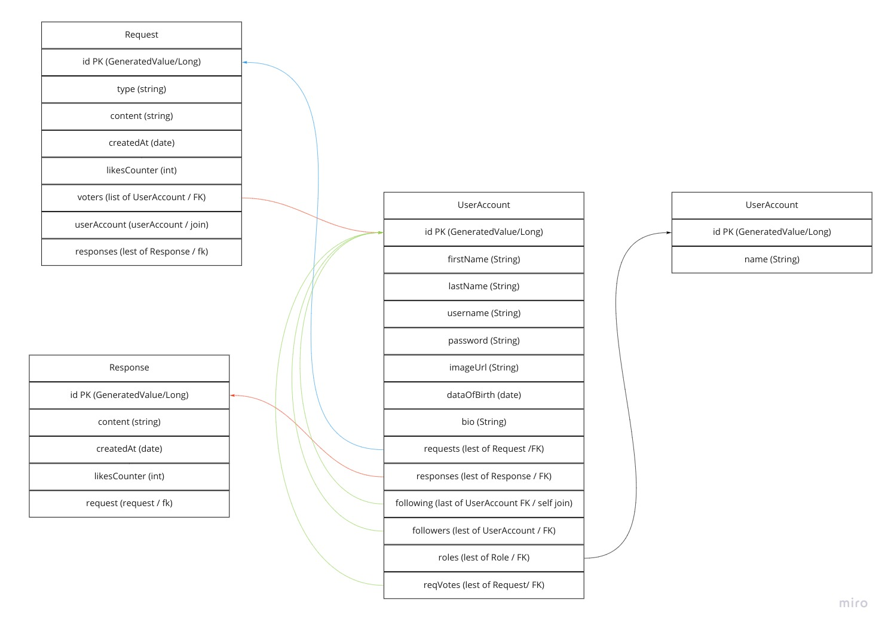
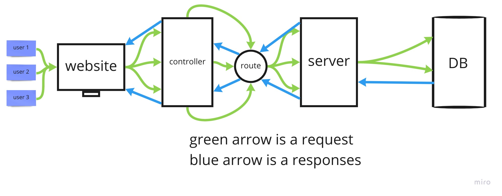

# Project: Midterm Prep #4

## User Stories

Title: User Story share a problem 

User Story sentence: I'd want to create an account, log in, and post a question that has to be answered in order for me to fulfill my project's responsibilities.

Featured Tasks: Choosing the right sort of post Getting the word out to as many people as possible The correct answer with the most votes is at the top of the list.

Acceptance Tests: Post a question and receive responses.

***

Title: Comment on a question

User Story sentence: View a series of questions on the questions and answers page and try to answer them based on your expertise or knowledge.

Featured Tasks: commint

Acceptance Tests: Look over the post and respond.

***

Title: user page

User Story sentence: I want to go to my personal page after signing in and see how many followers and followers I have, as well as read all of the posts and vote on them with the answers.

Featured Tasks: profile controller + JWT

Acceptance Tests: show my own profile

***

Title: Show other users

User Story sentence: I want to see any data for this individual on a profile page about him, the question he posed with the responses, and the option to follow or 

unfollow him when I click on his name.

Featured Tasks: visit user

Acceptance Tests: show other user profile

***

Title: View the list of followers or following

User Story sentence: Following a visit to my personal page, I'd like to present followers in a list with information such as their name and meta description.

Featured Tasks: visit Following or Followers

Acceptance Tests: show my  Following or Followers

***

Domain Modeling

## Scope (In/Out)

## IN - What will your product do
Describe the individual features that your product will do.

User can create an account that has his/her own information.

User can pick his/her own interest to be viewed.

User can write his/her own words in a post.

User can see others posts.

User will be able to comment on others posts.

User will be able to like others posts.

 

## OUT - What will your product not do
User can't post any picture.

User can't chat or call others.

## Feature tasks